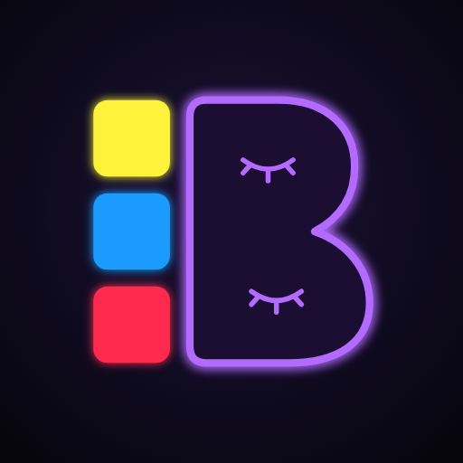
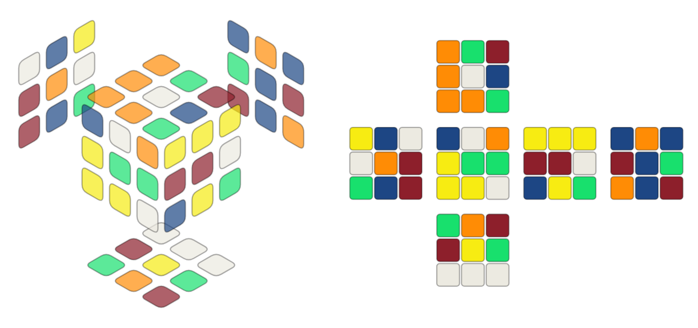
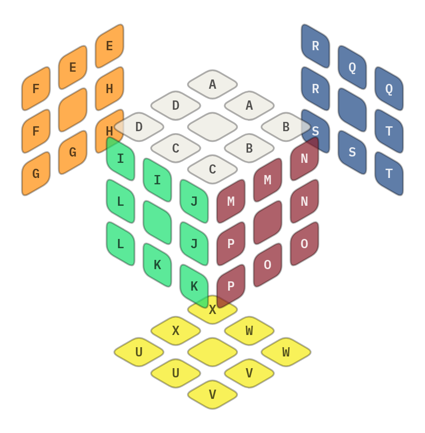
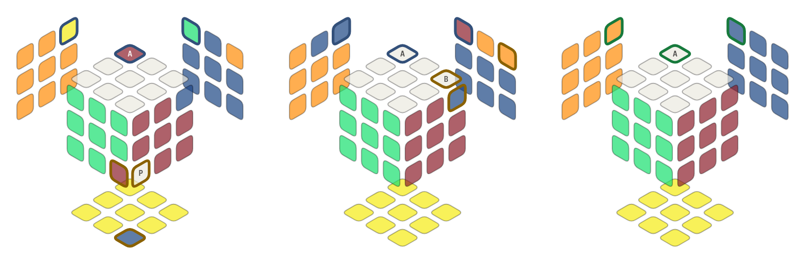
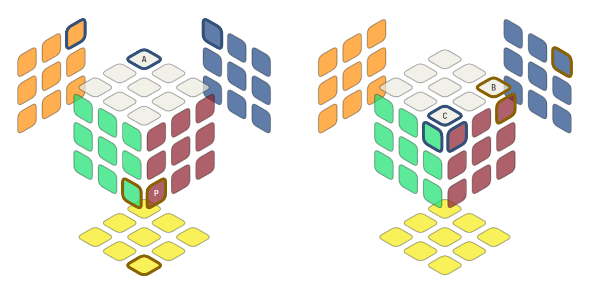
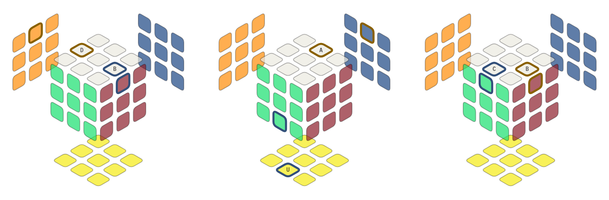
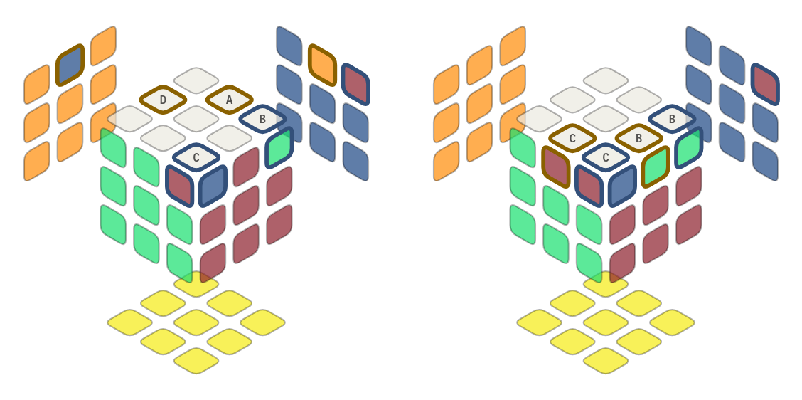

<div align="center">



# BLD Trainer

A practice tool for 3x3 blindfolded solving.

**[lehoffenberger.github.io/bld-trainer](https://lehoffenberger.github.io/bld-trainer/)**

<picture>
  <source media="(prefers-color-scheme: dark)" srcset="img/hero-dark.png">
  
</picture>

</div>

## Install

It runs in the browser. You can also install it as an app, which then opens full screen and works offline.

| Device | How |
|---|---|
| iPhone / iPad | Open the link in Safari → Share → Add to Home Screen |
| Android | Open the link in Chrome → ⋮ → Install app |
| Mac | Safari → File → Add to Dock, or the install icon in Chrome's address bar |
| Windows / Linux | The install icon in the address bar of Chrome or Edge |

You don't need an account, and the app doesn't save any of your data. Updates install themselves: the new version shows up the second time you open the app after an update. To remove it, delete it like any other app.

## Guide

### Three branches

- **Scramble**: scramble a solved cube using letter pairs.
- **Memorize**: trace the scramble and type your pairs. Each pair is checked as you type it. Afterward you can test yourself: type the pairs from memory with the cube hidden.
- **Execute**: solve your cube, timed or not, then step through the solution.

### Speffz lettering

Each sticker gets a letter, A–X, going clockwise around each face in the order U, L, F, R, B, D. Corners and edges each have their own A–X.

<picture>
  <source media="(prefers-color-scheme: dark)" srcset="img/speffz-dark.png">
  
</picture>

### Buffers, helpers, and methods

Your buffer is the piece you track. A helper is the piece a pair sends it to. Two shots make one pair, which is one algorithm.

Old Pochmann corners, solving the pair PB:

<picture>
  <source media="(prefers-color-scheme: dark)" srcset="img/pb-dark.png">
  
</picture>

The buffer (A) holds P. After you shoot P, it holds B. After you shoot B, the pair is done. The two edges swapped in the middle picture are a side effect of Old Pochmann's corner alg, and they swap back on the second shot.

Each method's buffer, outlined in blue, with an example helper in gold:

<picture>
  <source media="(prefers-color-scheme: dark)" srcset="img/corners-dark.png">
  
</picture>

<picture>
  <source media="(prefers-color-scheme: dark)" srcset="img/edges-dark.png">
  
</picture>

| Group | Method | Buffer | Example helper |
|---|---|---|---|
| Corners | Old Pochmann | A (UBL) | P |
| Corners | Orozco / EKA / 3-Style | C (UFR) | B |
| Edges | Old Pochmann | B (UR) | D |
| Edges | M2 | U (DF) | A |
| Edges | Orozco / EKA / 3-Style | C (UF) | B |

You can change buffers in Setup. The trainer accepts any helper that's part of a shortest solution, not just the one it would pick.

### Parity

Parity happens when an odd number of swaps solves the cube. A parity alg swaps two corners and two edges, and it goes last in a solution. Your corner method determines the default alg:

<picture>
  <source media="(prefers-color-scheme: dark)" srcset="img/parity-dark.png">
  
</picture>

| Corner method | Parity alg |
|---|---|
| Old Pochmann | R-perm (left) |
| Orozco / EKA / 3-Style | J-perm (right) |

The full guide is in the app under **Guide**.

## Run it locally

The whole app is one HTML file.

```bash
git clone https://github.com/lehoffenberger/bld-trainer.git
cd bld-trainer
python3 -m http.server 8000
```

Then open `localhost:8000`.

## Credits

The cube model follows [cube.js](https://github.com/ldez/cubejs) (MIT) and [Herbert Kociemba](http://kociemba.org/cube.htm). [Speffz](https://www.speedsolving.com/wiki/index.php/Speffz) lettering is by Ville Seppänen and Rob Holt. Old Pochmann and M2 are by Stefan Pochmann, and 3-Style (Beyer–Hardwick) is by Chris Hardwick and Daniel Beyer. Orozco is by Gabriel Alejandro Orozco Casillas. To learn the methods, see [J Perm's BLD tutorials](https://www.jperm.net/bld).
